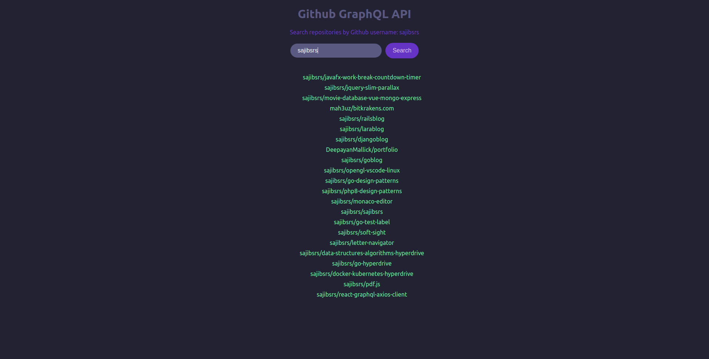

# Github GraphQL API
A react application that uses *Axios* as *GraphQL* client to fetch data from Github GraphQL API. Resository list can be received by searching by the Github username.


### Features
* [x] Search repositories by Github username.
* [ ] Sorting method, currently descending order (default).
* [ ] Filter to exclude forked repositories.
* [ ] Add result limit and pagination.


### Installation and setup
1. [Clone repository](https://docs.github.com/en/repositories/creating-and-managing-repositories/cloning-a-repository)
2. [Installing NodeJS with NVM](https://github.com/nvm-sh/nvm#installing-and-updating)
3. Install dependencies by running 
   

   ```shell
   npm install
   ```
   or 
   ```shell
   npm i
   ```

   in the terminal inside project root directory.


4. [Setting up Github token](https://docs.github.com/en/authentication/keeping-your-account-and-data-secure/creating-a-personal-access-token).
5. Create a `.env` file in the project root directory and add Github access token inside. Something like `REACT_APP_GITHUB_ACCESS_TOKEN=youraccesstoken`, don't forget to add `REAC_APP_` part at the beginning of the veriable. Otherwise, you'll face problem receiving that veriable through `process.env`. *You should include `.env` to your **.gitignore** file*.
6. Run application by:
   
   
   ```shell
   npm start
   ```
   This will launch the application on a new browser window at http://localhost.3000
